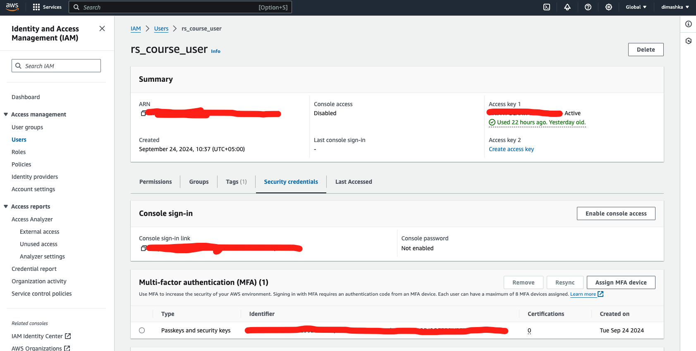
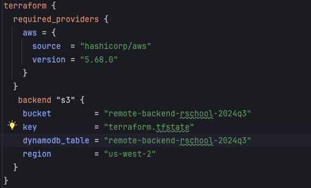
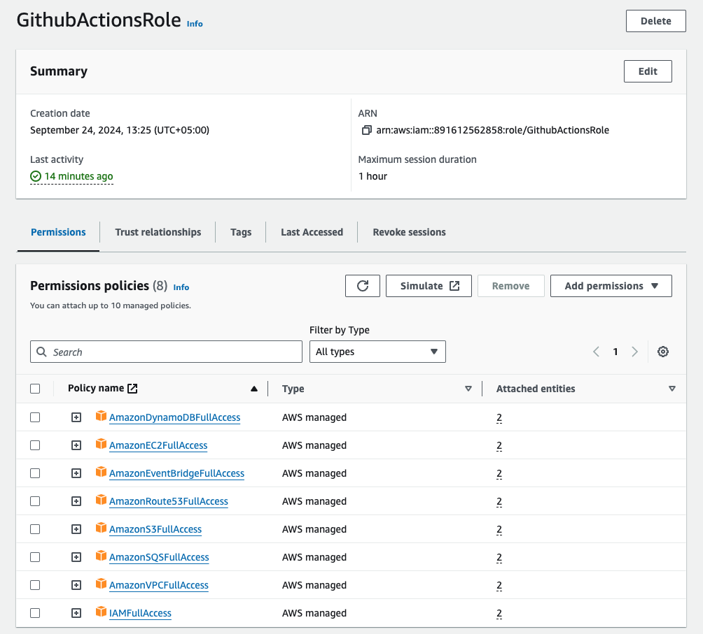
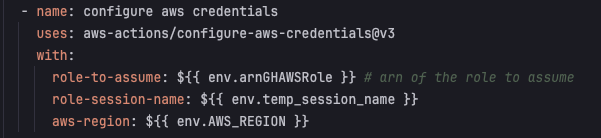
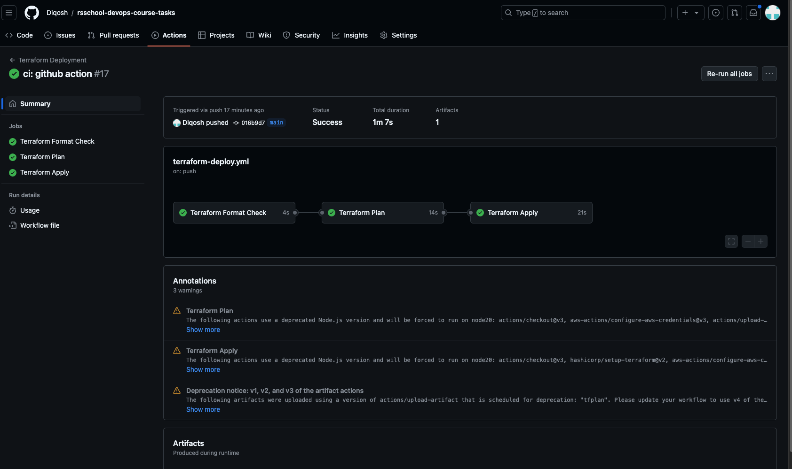
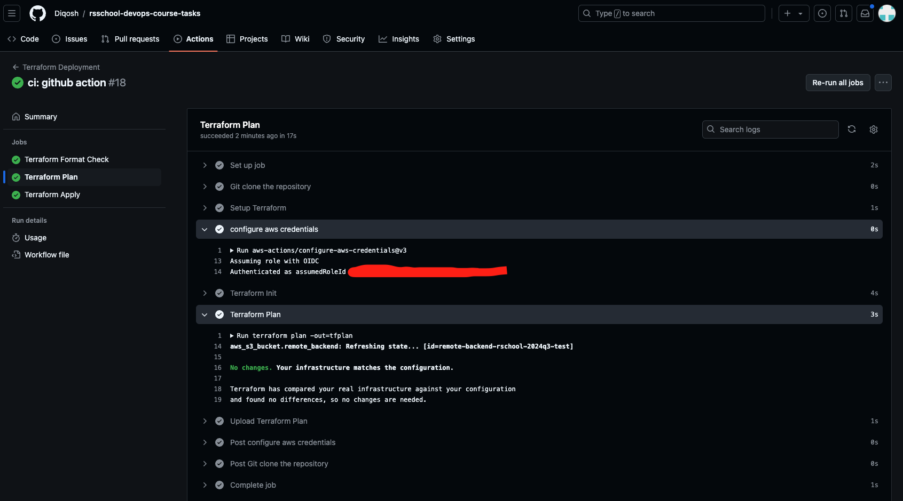

# AWS Account Configuration

This project sets up the initial configuration for an AWS account, including MFA for a non-root user, an S3 bucket for Terraform states, and an IAM role for GitHub Actions.

## Evaluation Criteria

### 1. MFA User Configured (10 points)

- [+] Non-root account secured by MFA

### 2. Bucket and GithubActionsRole IAM Role Configured (30 points)

- [ ] Terraform code for S3 bucket

- [ ] Terraform code for IAM role with correct Identity-based and Trust policies

The Terraform code for these resources can be found in the following files:
- `remote backend bucket configuration in 0_remote_backend folder` 
### 3. GitHub Actions Workflow Created (30 points)

- [ ] Workflow includes all required jobs

The GitHub Actions workflow can be found in `.github/workflows/terraform_deployment.yml`.

### 4. Code Organization (10 points)

- [ ] Variables defined in a separate file
- [ ] Resources separated into different files

Our code is organized as follows:
- `variables.tf`: Contains all variable definitions
- `main.tf`: Main configuration file

### 5. Verification (10 points)

- [ ] Terraform plan executed successfully for `GithubActionsRole`
- [ ] Terraform plan executed successfully for Terraform state bucket

### 6. Additional Tasks (10 points)

#### Documentation (5 points)

This README serves as documentation for the infrastructure setup and usage.

#### Submission (5 points)

- [ ] GitHub Actions pipeline is passing

**TODO:** Add a screenshot of the passing GitHub Actions pipeline.

## Usage

1. Clone this repository
2. Install Terraform
3. Configure AWS credentials
4. Run `terraform init` to initialize the Terraform working directory
5. Run `terraform plan` to see the execution plan
6. Run `terraform apply` to apply the changes

## Resources Created

- S3 bucket for Terraform state storage
- IAM role for GitHub Actions with necessary permissions
- MFA-enabled IAM user (created manually)

## Notes

- Ensure that you have the necessary AWS permissions to create these resources
- The MFA for the non-root user should be set up manually in the AWS console
- Review and adjust the IAM role permissions as needed for your specific use case